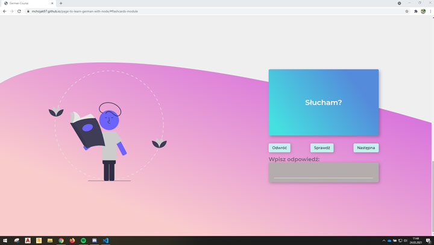

# Website to learn German
> Website where you can learn German using flashcards.

## Table of contents
* [General info](#general-info)
* [Screenshots](#screenshots)
* [Technologies](#technologies)
* [Setup](#setup)
* [Status](#status)
* [Contact](#contact)

## General info
Project which I made with HTML, SCSS and JavaScript. On this website you can choose one of three modules: polish-german, german-polish or phrases. In the future I want to add control panel, where user can add new flashcards and save progress. 

## Screenshots
* Desktop Version

## Technologies
* JavaScript
* HTML5
* CSS3

## Setup
If you want to see my page, you can do it on your local computer(download this repositorie, type in terminal: _npm install_, then _npm run dev_) or just visit https://mchojak97.github.io/page-to-learn-german/

## Status
Project is _in progress_.

## Contact
Created by [@Maciej Chojak](https://mchojak97.github.io/myportfolio-website/) - feel free to contact me!